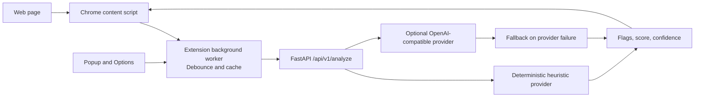

# TruthLens

TruthLens is a browser-assisted claim analysis tool. A Chrome extension sends page text to a FastAPI backend, which returns flags, confidence, and provider metadata for the user to review.

## Repository layout

- `backend/` — FastAPI service, analysis endpoints, tests, and heuristic/LLM provider handling
- `extension/` — TypeScript/React Chrome extension and webpack build

## Run the backend

```bash
cd backend
python -m venv .venv
source .venv/bin/activate
pip install -r requirements.txt
uvicorn app.main:app --reload
```

The API listens on `http://127.0.0.1:8000` by default. Set `OPENAI_API_KEY` to enable the optional OpenAI-compatible provider; without it, the backend uses deterministic heuristic analysis.

## Build the extension

```bash
cd extension
npm install
npm run build
```

Load the generated `extension/dist/` directory as an unpacked extension in Chrome. The extension's Options page can be used to change the backend URL.

See the component READMEs in `backend/` and `extension/` for endpoint details and feature-specific instructions.

## Architecture


